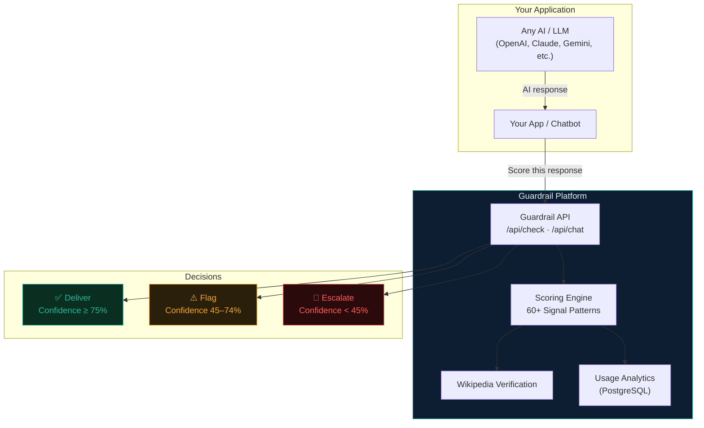
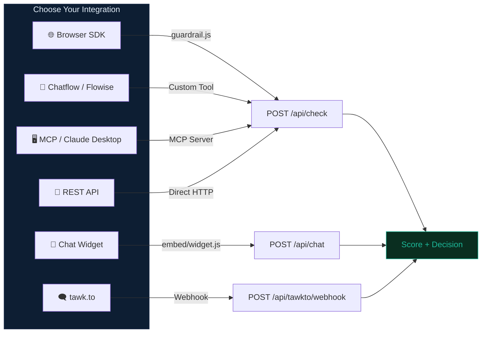
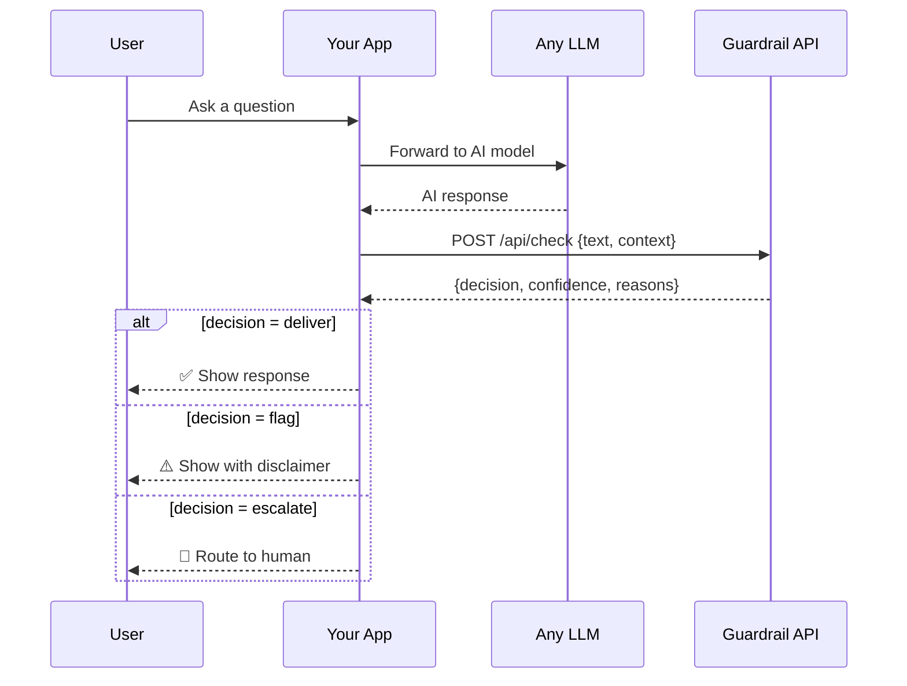
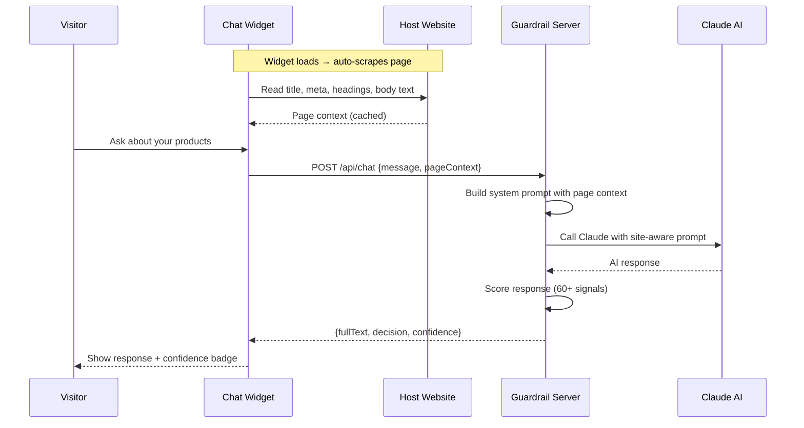
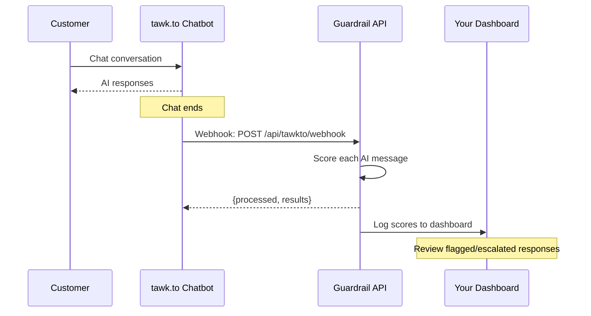
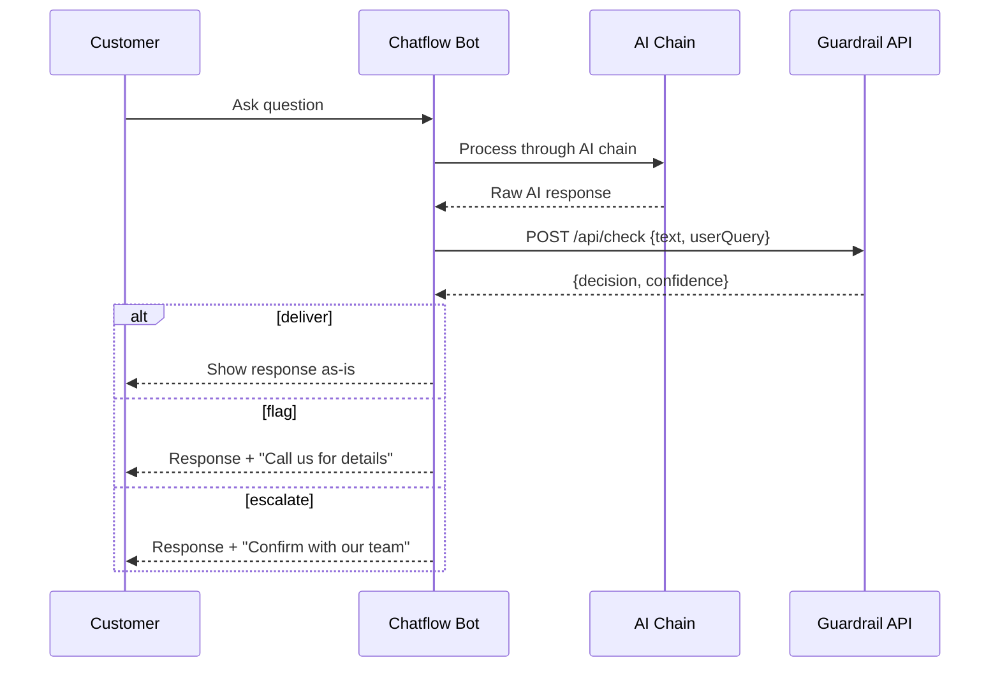
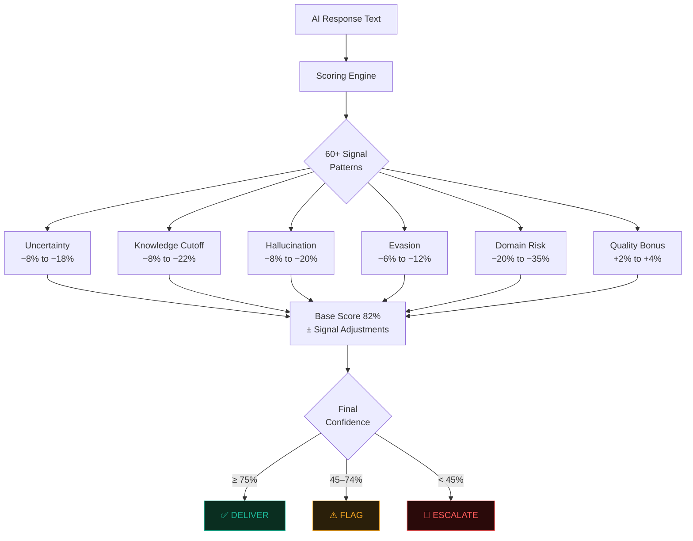

# 🛡️ Guardrail — How It Works

> The AI Escalation Intelligence Layer

## High-Level Architecture

---

## Integration Paths

Choose the integration that fits your stack:

---

## Flow 1 — SDK Integration (Any AI Model)

Best for: **Custom apps with any LLM**

---

## Flow 2 — Chat Widget (Drop-in, Site-Aware)

Best for: **Adding AI chat to any website**

---

## Flow 3 — tawk.to (Post-Chat Audit)

Best for: **Monitoring existing chatbot quality**

---

## Flow 4 — Chatflow / Flowise (Inline Safety)

Best for: **No-code chatbot builders**

---

## Decision Logic

---

## Getting Started

1. **Sign up** → [guardrail-mvp-production.up.railway.app](https://guardrail-mvp-production.up.railway.app)
2. **Get your API key** → `gr_live_xxx`
3. **Pick an integration** → SDK, Widget, Chatflow, tawk.to, MCP, or REST
4. **See results** → [Developer Dashboard](https://guardrail-mvp-production.up.railway.app/developer.html)
