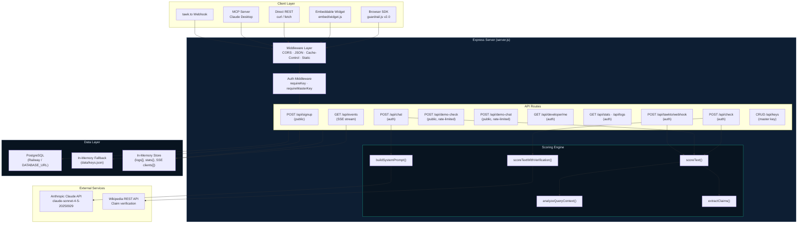
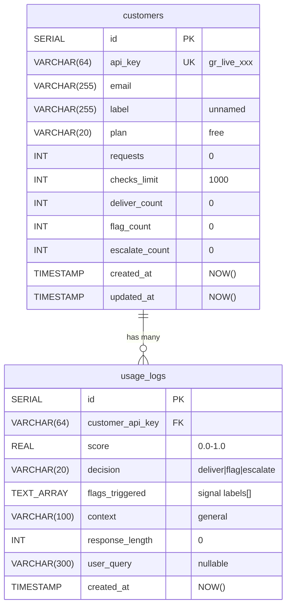
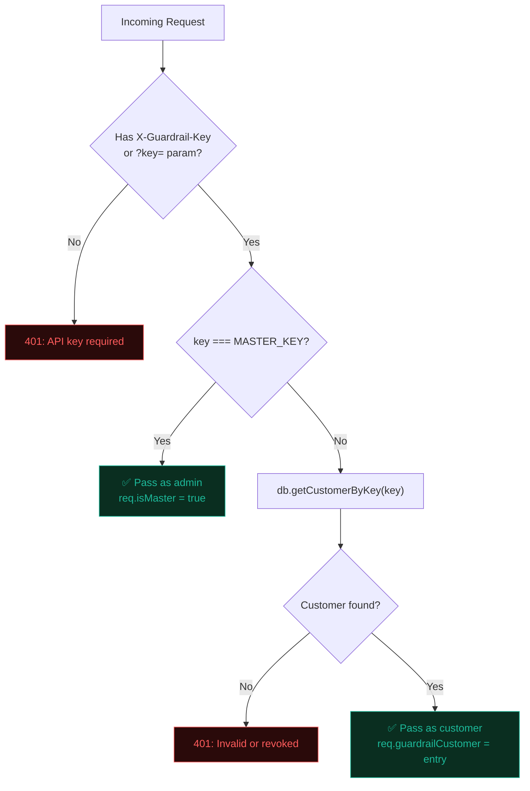
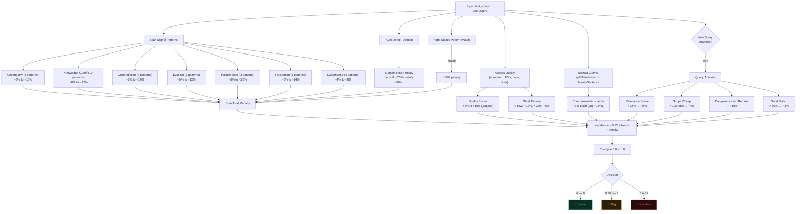
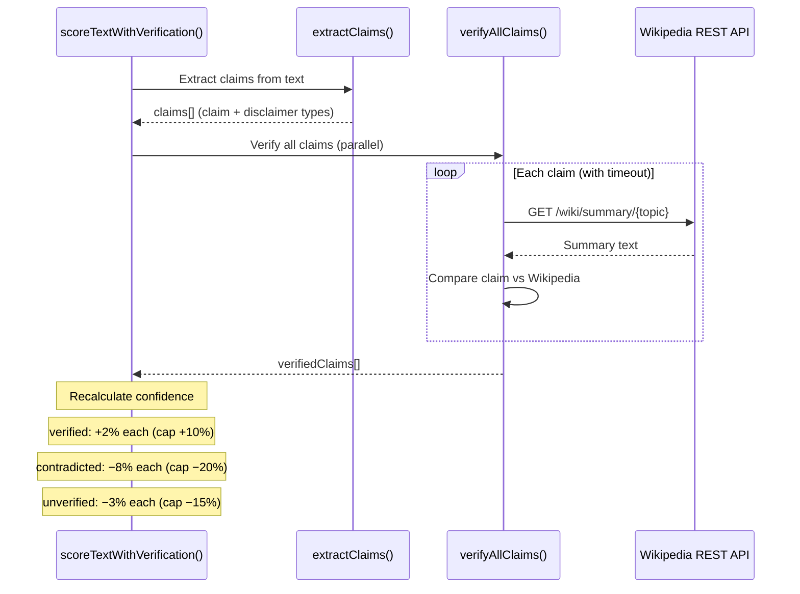
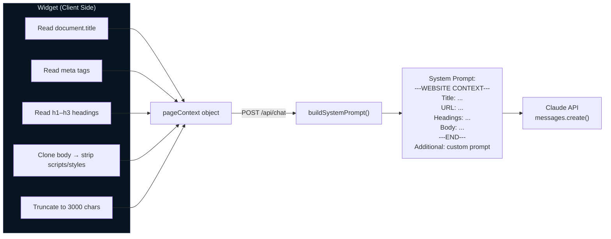
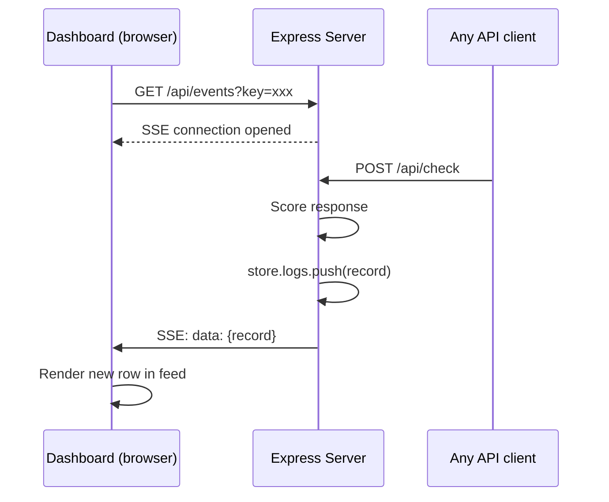

# Guardrail AI — Internal Architecture Reference

> **Audience:** Engineering team / internal reference  
> **Last Updated:** 2026-04-01

---

## System Architecture



---

## Data Model



### Indexes
| Table | Index | Column |
|---|---|---|
| `customers` | `idx_customers_email` | `email` |
| `usage_logs` | `idx_usage_logs_key` | `customer_api_key` |
| `usage_logs` | `idx_usage_logs_created` | `created_at` |

### Storage Modes
| Mode | Trigger | Customers | Logs |
|---|---|---|---|
| **PostgreSQL** | `DATABASE_URL` set | `customers` table | `usage_logs` table |
| **In-Memory** | No `DATABASE_URL` | `data/keys.json` (Map) | In-memory array (max 500) |

---

## Authentication Flow



---

## Scoring Engine Pipeline



---

## Wikipedia Verification Pipeline



---

## Page Context Scraping → System Prompt



---

## SSE Real-Time Dashboard



---

## Request Rate Limits

| Endpoint | Limit | Window | Tracking |
|---|---|---|---|
| `/api/demo-check` | 5 requests | Per hour | Per IP |
| `/api/demo-chat` | 10 requests | Per hour | Per IP |
| `/api/check` | Unlimited | — | Per API key |
| `/api/chat` | Unlimited | — | Per API key |
| `/api/signup` | Unlimited | — | Idempotent per email |

---

## Technology Stack

| Layer | Technology |
|---|---|
| **Runtime** | Node.js |
| **Framework** | Express.js |
| **Database** | PostgreSQL (Railway) / In-memory fallback |
| **AI** | Anthropic Claude (claude-sonnet-4-5-20250929) |
| **Verification** | Wikipedia REST API |
| **Hosting** | Railway (Nixpacks builder) |
| **Frontend** | Vanilla HTML/CSS/JS (no framework) |
| **SDK** | UMD module (browser + Node.js) |
| **MCP** | @modelcontextprotocol/sdk |

---

## File Structure

```
guardrail-mvp/
├── server.js           # Express app, routes, scoring engine (~1060 lines)
├── db.js               # PostgreSQL + in-memory DB layer
├── init_db.js           # Schema creation + migration script
├── wikipedia.js         # Claim verification against Wikipedia
├── sdk/
│   └── guardrail.js     # Browser/Node SDK (UMD)
├── public/
│   ├── index.html       # Landing page
│   ├── docs.html        # API reference
│   ├── playground.html  # Interactive scorer
│   ├── chat.html        # Claude chat demo
│   ├── developer.html   # Developer portal
│   ├── dashboard.html   # Real-time SSE feed
│   ├── embed/
│   │   └── widget.js    # Embeddable chat widget
│   └── ...              # Guides, blog posts
├── mcp/
│   └── server.js        # MCP server for Claude Desktop
├── docs/
│   ├── architecture_customer.md   # Customer architecture doc
│   ├── architecture_internal.md   # This file
│   └── widget_site_context.md     # Widget scraping docs
├── data/
│   └── keys.json        # Local key store (dev/test)
└── server.test.js       # 162 tests
```
